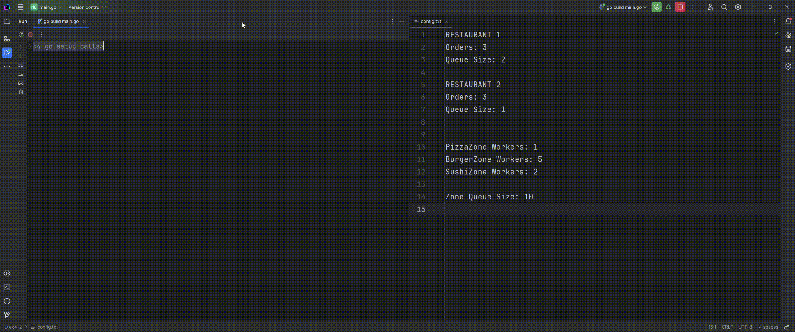

# Restaurant Order Processing System

## Overview
This project simulates a **concurrent restaurant order processing system** using **Go’s goroutines and channels**. Multiple restaurants generate orders, which are dispatched to specific zones (Pizza, Burger, Sushi) and processed concurrently. The program handles dynamic order processing and graceful shutdowns.



---

## Features
- **Concurrent order processing:** Each zone processes orders concurrently using **tokens** to limit the number of workers.
- **Graceful shutdown:** Uses **context cancellation** to safely terminate all operations.
- **Dynamic order routing:** Orders are automatically dispatched to the correct zone based on their type.
- **Display Manager:** Monitors completed orders and prints them in a readable format.
- **Configurable:** The system reads its configuration from an easy-to-edit `config.txt` file.


---
## Project Structure
```
restaurant-order-system/
├── dispatcher.go        # Routes orders to the appropriate zone
├── displayManager.go    # Handles the display of completed orders
├── go.mod               # Module file for Go dependencies
├── main.go              # Main entry point for the program
├── producers.go         # Generates restaurant orders
├── zoneManagers.go      # Manages zone-specific order processing
└── config.txt           # Configuration file for restaurants and zones
```

---

## How It Works
1. **Producers** generate food orders for multiple restaurants and send them to a central dispatcher.
2. The **Dispatcher** forwards orders to the appropriate processing zones (Pizza, Burger, Sushi).
3. Each **Zone Manager** processes orders concurrently, using worker tokens to limit concurrency.
4. The **Display Manager** prints completed orders to the terminal in real-time.
5. The program gracefully shuts down when all orders have been processed.

---

## Configuration (config.txt)
Define the configuration for the system in the `config.txt` file:

RESTAURANT 1
Orders: 10
Queue Size: 5

RESTAURANT 2
Orders: 8
Queue Size: 4

PizzaZone Workers: 3
BurgerZone Workers: 2
SushiZone Workers: 1
Zone Queue Size: 10

**Explanation:**
- **RESTAURANT:** Defines the restaurant ID and settings for each restaurant.
- **Orders:** Number of orders to generate.
- **Queue Size:** Buffer size for each restaurant’s order queue.
- **Zone Workers:** Number of workers available in each zone.
- **Zone Queue Size:** Buffer size for each zone’s processing queue.

---

## Running the Project
1. **Clone the repository:**
   git clone https://github.com/almog-e/go-concurrent-order-system.git
   cd restaurant-order-system

2. **Ensure Go is installed:**
   go version

3. **Run the program:**
   go run .

4. **View the output:** The orders being processed and completed will be printed to the terminal.

---

## System Flow
1. **Producers** generate orders and send them to the dispatcher.
2. The **Dispatcher** routes orders to the correct zones.
3. **Zone Managers** process orders concurrently and send completed messages to the **Display Manager**.
4. The **Display Manager** prints out completed orders in real-time.

---

## Stopping the Program
To stop the program gracefully:
1. Press `Enter` in the terminal.
2. The system will trigger the cancellation signal and clean up all tasks before exiting.

---

## Future Improvements
- Implement a logging system to persist completed orders.
- Extend the system to support additional food zones dynamically.
- Provide a web-based interface to monitor orders in real-time.

---

## Example Output
Here’s what the output might look like in the terminal:
```
Display Manager started
Dispatcher started
BurgerZone started
PizzaZone started
Restaurant 2 started
Restaurant 2: Sushi 0
Restaurant 1 started
Restaurant 1: Pizza 0
SushiZone started
Restaurant 1: Sushi 0
Restaurant 2: Burger 0
Restaurant 1: Burger 0
Restaurant 2: Sushi 1
PizzaZone: Processing Restaurant 1: Pizza 0
Restaurant 1 completed all orders.
SushiZone: Processing Restaurant 2: Sushi 0
PizzaZone: Done Restaurant 1: Pizza 0
Manager Display: PizzaZone Restaurant 1: Pizza 0
SushiZone: Processing Restaurant 1: Sushi 0
SushiZone: Done Restaurant 2: Sushi 0
Manager Display: SushiZone Restaurant 2: Sushi 0
BurgerZone: Processing Restaurant 2: Burger 0
SushiZone: Done Restaurant 1: Sushi 0
Manager Display: SushiZone Restaurant 1: Sushi 0
BurgerZone: Processing Restaurant 1: Burger 0
Restaurant 2 completed all orders.
BurgerZone: Done Restaurant 2: Burger 0
Manager Display: BurgerZone Restaurant 2: Burger 0
Dispatcher: Producer 2 is done.
Dispatcher: Producer 1 is done.
Dispatcher: All producers are done, exiting.
PizzaZone: All orders processed, exiting.
SushiZone: Processing Restaurant 2: Sushi 1
BurgerZone: Done Restaurant 1: Burger 0
BurgerZone: All orders processed, exiting.
Manager Display: BurgerZone Restaurant 1: Burger 0
SushiZone: Done Restaurant 2: Sushi 1
SushiZone: All orders processed, exiting.
Main: All work completed.
Manager Display: SushiZone Restaurant 2: Sushi 1
Display Manager stopped
Shutting down...
3
2
1
Bye!

Process finished with the exit code 0
```
